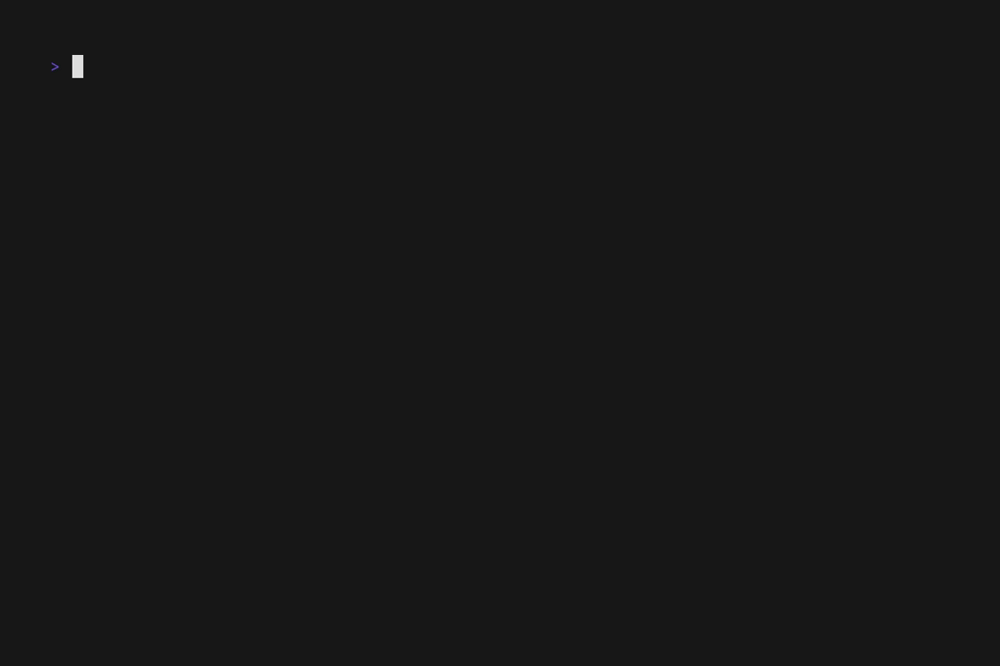

# Notes 

Here, I outline a few changes I have made and the rationale behind that change.

1. For my K3d environment, using the pre-defined command for setting up the cluster with its local registry failed to register the local registry with my cluster. 

- I modified the `k3d-config.yaml` file to be create and register the registry to the cluster. I now use the sole command :
```bash
k3d cluster create -c k3d-config.yaml
```
---

2. For installing ArgoCD unto my cluster, I opted to use my local Helm installation with a Helm values files here: [infra-k8s/k8s-apps/argocd/values.yaml](infra-k8s/k8s-apps/argocd/values.yaml). I opted to use the `argocdServerAdminPassword` value. If this values file will be used, the unencrypted password is in the comment above the line where `argocdServerAdminPassword` is located.

- I also installed Sealed Secrets controller since I anticipated that I will have to use some secret values. To make sure I store them securely when I store them in Git, I opted for this. You can can the values here: [infra-k8s/k8s-apps/sealed_secrets/values.yaml](infra-k8s/k8s-apps/sealed_secrets/values.yaml).

---

3. For the Flask application, I made changes to the [dependencies.py](my-service/my_service/dependencies.py) file. This change was made considering the fact the Traefik will handle the TLS termination and there will be no need to TLS communication between services inside the cluster and it will still be secure. The major change was to change the `https` to `http` and taking out the `verify=False` line too.

- In the [config.py](my-service/my_service/config/config.py) file, I modified the config defaults so that they will be taken from the environment variables passed to the environment. Also a change to build the `ARGOCD_URL` which previously could not be done via the old method.

---

4. I created an [app-of-apps.yaml](infra-k8s/app-of-apps.yaml) file that can be used to deploy the services wrt GitOps principles.

---

Check out the demo with this gif.

